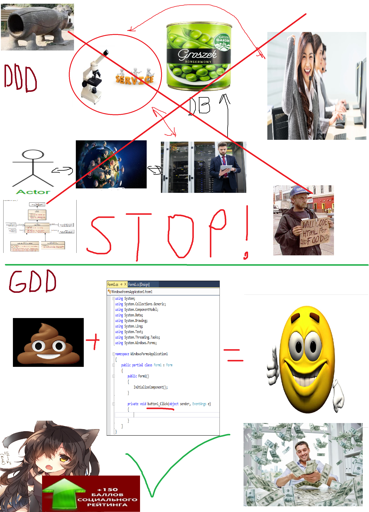

# GDD
G-Code Driven Development  

# Concept (Язык оригинала)
**Main rule: Minimum acceptable code quality.**
- If the Class is sufficiently self-contained and will not be reused in "atypical" scenarios, you MUST use the "GOD" classes.
- If "Refactoring" the code results in an big increase in the number of lines, this refactoring is NOT NEEDED.
- If an "Interface" is used by only one class, then that interface is not needed, just use the CLASS AS IS.
- If extract part of a method's code into a separate method does not affect the rest of the code, you SHOULD NOT extract the code into separate methods.
- The use of "Dependency Injections" is allowed only in case of emergency.
- Any changes "for beauty" are not allowed.
- If using a pattern will increase the number of classes in your code compared to code without the pattern, and you won't get REAL improvements, then you don't need to use that pattern.
- Changes that make the code harder to read, even if they improve the architecture, are NOT ALLOWED.
- Before you "separate the model from the view" consider whether you will ever actually replace the view.
- If the Model is inseparable from the View according to the "Business Logic" (Paint for example) - no need to make tons of classes using MVC/MVVM/..., just hardcode everything in the View.
- Big methods are the norm, just stop thinking about it, have a sedative.
- There is no point in "turning your code into abstract trash" for the Unit Testing. You don't usually leave your door open for the convenience of the FBI.
- Before you start implementing a "New Cool Method Of Development" that "Solves All The Problems", remember the previous ones, which are now declared garbage. The new approach will inevitably suffer the same fate. Perhaps you should fix the any bug, or go to a psychologist instead.
- If the Сlass has only one method - it's garbage, use a regular function.
- Use manual testing where you can do without Auto Tests.
- ALWAYS manually test the View. Autotests will not find real problems and regressions here.
- When a Cool Architecture Mentor comes to your old project, give him the INITIAL business requirements and ask him to sketch out the architecture. Buy a popcorn. Then show the CURRENT business requirements, and ask to see how they relate to its architecture. Yummy.
- If someone who offers a Cool New Approach, sells books, speaks at paid conferences, or receives donations - think about it. I accept donations. Think.

# Концепция
**Основное правило: минимально приемлемое качество кода.**
- Если класс достаточно автономен и не будет повторно использоваться в «нетипичных» сценариях, вы ДОЛЖНЫ использовать "GOD" классы.
- Если "Рефакторинг" кода приводит к большому увеличению количества строк, этот рефакторинг НЕ НУЖЕН.
- Если "Интерфейс" используется только одним классом, то этот интерфейс не нужен, просто используйте КЛАСС КАК ЕСТЬ.
- Если извлечение части кода метода в отдельный метод не влияет на остальную часть кода, НЕ СЛЕДУЕТ извлекать код в отдельные методы.
- Использование «Инъекций зависимостей» разрешено только в случае крайней необходимости.
- Любые изменения "для красоты" не допускаются.
- Если использование шаблона увеличит количество классов в вашем коде по сравнению с кодом без шаблона, и вы не получите НАСТОЯЩИХ улучшений, то вам не нужно использовать этот шаблон.
- Изменения, затрудняющие чтение кода, даже если они улучшают архитектуру, ЗАПРЕЩЕНЫ.
- Прежде чем «отделить модель от вида», подумайте, будете ли вы когда-нибудь заменять вид.
- Если модель неотделима от представления в соответствии с «Бизнес-Логикой» (например редатор Paint) - не нужно создавать кучу классов с использованием MVC/MVVM/..., просто хардкодьте все в Представлении.
- Большие методы - это норма, просто перестань думать об этом, выпей успокоительного.
- Нет смысла «превращать ваш код в абстрактный мусор» для модульного тестирования. Обычно ты не оставляешь дверь открытой для удобства ФБР.
- Прежде чем приступить к реализации «Нового Классного Метода Разработки», который «Решает Все Проблемы», вспомните предыдущие, которые теперь объявлены мусором. Новый подход неизбежно постигнет та же участь. Возможно, вам стоит исправить какой-либо баг или сходить к психологу.
- Если у Сlass только один метод — это мусор, используйте обычную функцию.
- Используйте ручное тестирование там, где можно обойтись без автотестов.
- ВСЕГДА вручную тестируйте представление. Настоящих проблем и регрессий автотесты здесь не найдут.
- Когда Крутой Наставник По Архитектуре прийдет в ваш старый проект, сообщите ему НАЧАЛЬНЫЕ бизнес-требования и попросите его набросать архитектуру. Купите попкорн. Затем покажите ТЕКУЩИЕ бизнес-требования и попросите посмотреть, как они соотносятся с его архитектурой. Мякотка.
- Если кто-то предлагает Крутой Новый Подход, продает книги, выступает на платных конференциях, или получает пожертвования — задумайся об этом. Я принимаю донаты. Думай.
- Если кто-то, педлагающий Новый Крутой Подход, продает платные консультации, то он хочет нагреть гоя. Я осуществляю платные консультарции, писать в Телеграм: @turborium.

## Критика
- [Критика от ChatGPT](reviews/ChatGPT.md)

## Проекты созданные с использованием методологии разработки GDD
- [TurboPixel PWA PixelArt Camera](https://github.com/turborium/turbopixel)
